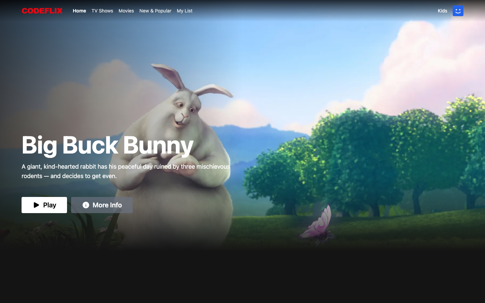

# 🎬 Codeflix — Subscriber Portal

A Netflix-style streaming platform where subscribers browse the catalog, search for titles and watch videos.



> 🚧 Work in progress — follow the evolution through the [Releases](../../releases) and Pull Requests.

## 🧰 Tech stack

- [Next.js 14](https://nextjs.org/) (App Router) + React 18
- TypeScript
- Tailwind CSS
- Heroicons
- ESLint + Prettier

## 🏗️ Architecture

This repository is the **"Video catalog frontend"** container of the Codeflix system.
The C4 diagram of the whole system lives in [`docs/architecture/codeflix-c4.puml`](docs/architecture/codeflix-c4.puml).

## 🚀 Running locally

Requirements: Node.js 18.17+ (see `.nvmrc`) and Yarn.

```bash
yarn install
yarn dev
```

Open <http://localhost:3000>.

## 🎓 Credits

Built during the **[Full Cycle 3.0](https://fullcycle.com.br)** course — _Codeflix Subscriber Portal_ module.

### Media

- Banner image: _Big Buck Bunny_ © 2008 [Blender Foundation](https://peach.blender.org), licensed under [CC BY 3.0](https://creativecommons.org/licenses/by/3.0/).
